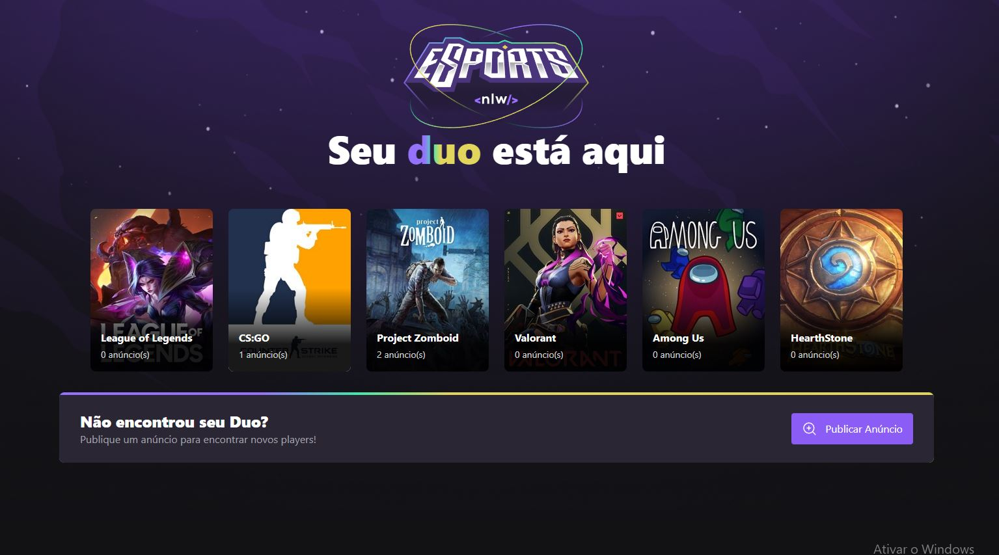

# NLW-Web-Esports

</img>

##🚀 Tecnologias

### Front-end
- HTML
- CSS
- JavaScript
- TypeScript
- ReactJS
- TailwindCSS
- Radix UI

### Back-end
- NodeJS
- Express
- Prisma
- SQLite

### Mobile
- React Native
- Expo

## 🎨 Layout:

Figma: https://www.figma.com/file/fMH9LY1h1ngivGZBuq7zm5/NLW-eSports-(Community)?node-id=6%3A131

## :memo: Licença

Esse projeto está sob a licença MIT. Veja o arquivo [LICENSE](LICENSE) para mais detalhes.

---

Feito por Felipe Joazeiro
